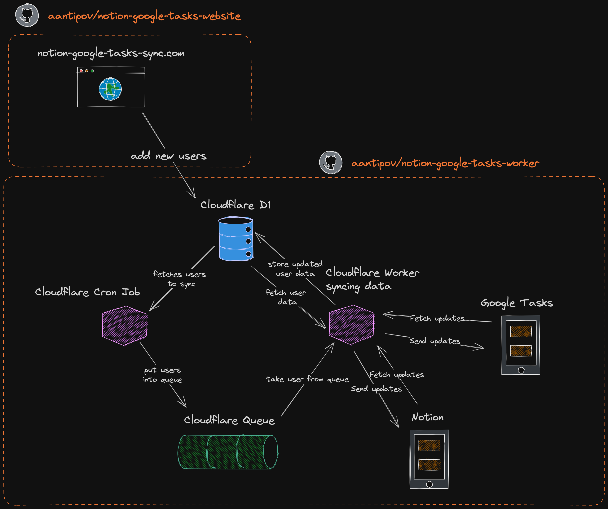

# Notion-Google Tasks Sync CRON Worker

## Overview

This repository contains the CRON Worker for the [Notion-Google Tasks Sync Service](https://notion-google-tasks-sync.com/). Implemented as a Cloudflare Worker, it plays a crucial role in ensuring continuous synchronization between users' Notion databases and Google Tasks.



### Features

- **Automated Synchronization**: Scheduled to run every minute, syncing tasks as per user configurations.
- **Data Integrity**: Safeguards data consistency between Notion and Google Tasks.
- **Efficient Data Handling**: Utilizes Cloudflare D1 for robust and secure data management.

## Prerequisites

- Cloudflare account and Workers configuration.
- Access to Cloudflare D1 (relational database).
- Google Cloud Platform account for Google Tasks API.
- Notion Integration setup for Notion API.

## Installation

1. Clone the Repository:

   ```bash
   git clone https://github.com/aantipov/notion-google-tasks-worker.git
   ```

1. Configure Cloudflare Worker:

- Set up your Cloudflare Worker environment.
- Configure environment variables for API access and database connections.

1. Cloudflare D1 Setup:

- Ensure the database schema matches the expected format.
- Securely store user tokens and mapping data.

## Usage

The CRON Worker is designed to be deployed as a Cloudflare Worker. Once deployed, it operates automatically based on the configured schedule.

1. Deployment:

- Use Cloudflare's deployment tools to deploy the Worker.
- Verify the Worker is active in your Cloudflare dashboard.

2. Monitoring:

- Regularly check logs for any potential issues.
- Monitor database performance and storage usage.

## Contributing

Contributions to improve the CRON Worker are welcomed. Please follow the standard GitHub pull request process to submit your changes.

## Reporting Issues

For any issues or feature requests, please create an issue in the repository's issue tracker.

## License

This project is licensed under MIT - see the LICENSE file for details.
